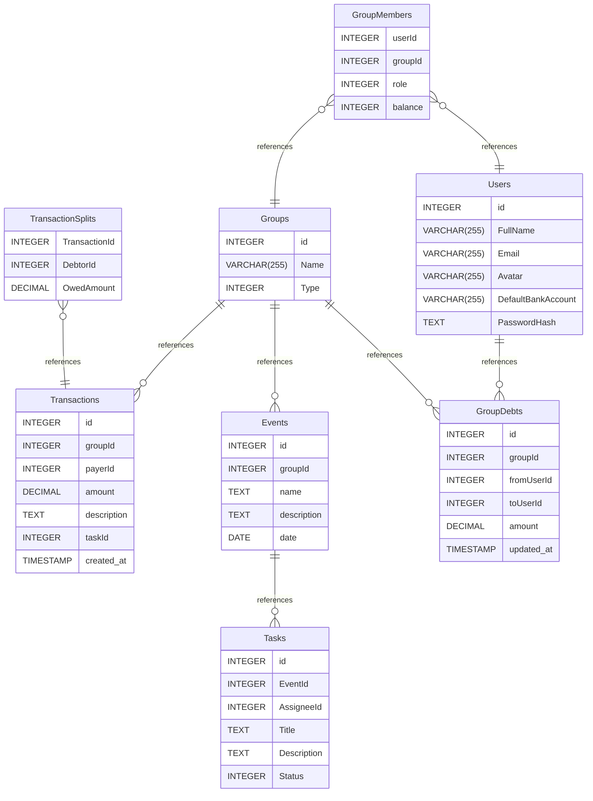

# WeShare - Smart Bill Splitting & Task Management

## Overview

WeShare is an "All-in-one" mobile application designed to solve financial management and task distribution challenges for student clubs, groups of friends, and travel teams.

Unlike traditional bill-splitting apps, WeShare tightly integrates Task Management with Finance. It promotes financial transparency, automatically calculates complex debts, and streamlines the reimbursement process via QR Codes.

The project is built as a Fullstack solution using React Native for the frontend and .NET 8 (Clean Architecture) for the backend.

## Key Features

* **Smart Split:** Supports splitting bills equally, by exact amounts, or by percentages.
* **Debt Simplification:** Automatically analyzes and reduces circular debts among members to minimize the number of required transactions (similar to Splitwise logic).
* **Task-to-Bill Integration:** A unique feature that allows users to instantly convert a completed task (e.g., "Grocery Shopping") into an expense transaction.
* **Transparent Reporting:** Track expenses by specific Groups (Event-based) or view a consolidated summary of personal debts (Friend-based).
* **VietQR Support:** Integrated personal QR code generation to facilitate one-touch debt settlement ("Settle Up").

## Tech Stack

### Mobile App (Frontend)
* **Framework:** React Native (Expo/CLI)
* **Language:** TypeScript
* **State Management:** Redux Toolkit
* **Data Fetching:** TanStack Query (React Query)
* **UI Library:** React Native Paper / Tamagui

### Backend & Database
* **Framework:** ASP.NET Core 8 Web API
* **Architecture:** Clean Architecture
* **Database:** PostgreSQL
* **ORM:** Entity Framework Core (Code First)
* **Real-time:** SignalR (For notifications)
* **Authentication:** JWT (JSON Web Token)

## Database Architecture
The project utilizes a **Hybrid Debt Logic** model. It combines historical transaction storage (`Transactions`) with an optimized debt table (`GroupDebts`) to ensure high performance and accurate "Who owes Whom" calculations.
# WeShareERD documentation
## Summary

- [Introduction](#introduction)
- [Database Type](#database-type)
- [Table Structure](#table-structure)
	- [Users](#users)
	- [Groups](#groups)
	- [GroupMembers](#groupmembers)
	- [Transactions](#transactions)
	- [TransactionSplits](#transactionsplits)
	- [Events](#events)
	- [Tasks](#tasks)
	- [GroupDebts](#groupdebts)
- [Relationships](#relationships)
- [Database Diagram](#database-diagram)

## Introduction

## Database type

- **Database system:** PostgreSQL
## Table structure

### Users

| Name        | Type          | Settings                      | References                    | Note                           |
|-------------|---------------|-------------------------------|-------------------------------|--------------------------------|
| **id** | INTEGER | 🔑 PK, not null, unique, autoincrement | fk_Users_id_GroupDebts | |
| **FullName** | VARCHAR(255) | not null |  | |
| **Email** | VARCHAR(255) | not null |  | |
| **Avatar** | VARCHAR(255) | null |  | |
| **DefaultBankAccount** | VARCHAR(255) | null |  | |
| **PasswordHash** | TEXT | not null |  | | 

### Groups

| Name        | Type          | Settings                      | References                    | Note                           |
|-------------|---------------|-------------------------------|-------------------------------|--------------------------------|
| **id** | INTEGER | 🔑 PK, not null, unique, autoincrement | fk_Groups_id_Transactions,fk_Groups_id_Events,fk_Groups_id_GroupDebts | |
| **Name** | VARCHAR(255) | not null |  | |
| **Type** | INTEGER | not null |  | | 

### GroupMembers

| Name        | Type          | Settings                      | References                    | Note                           |
|-------------|---------------|-------------------------------|-------------------------------|--------------------------------|
| **userId** | INTEGER | 🔑 PK, not null, unique | fk_GroupMembers_userId_Users | |
| **groupId** | INTEGER | 🔑 PK, not null | fk_GroupMembers_groupId_Groups | |
| **role** | INTEGER | not null |  | |
| **balance** | INTEGER | not null |  | | 

### Transactions

| Name        | Type          | Settings                      | References                    | Note                           |
|-------------|---------------|-------------------------------|-------------------------------|--------------------------------|
| **id** | INTEGER | 🔑 PK, not null, unique, autoincrement |  | |
| **groupId** | INTEGER | not null |  | |
| **payerId** | INTEGER | not null |  | |
| **amount** | DECIMAL | not null |  | |
| **description** | TEXT | null |  | |
| **taskId** | INTEGER | null |  | |
| **created_at** | TIMESTAMP | null |  | | 

### TransactionSplits

| Name        | Type          | Settings                      | References                    | Note                           |
|-------------|---------------|-------------------------------|-------------------------------|--------------------------------|
| **TransactionId** | INTEGER | 🔑 PK, not null | fk_TransactionSplits_TransactionId_Transactions | |
| **DebtorId** | INTEGER | 🔑 PK, not null |  | |
| **OwedAmount** | DECIMAL | not null |  | | 

### Events

| Name        | Type          | Settings                      | References                    | Note                           |
|-------------|---------------|-------------------------------|-------------------------------|--------------------------------|
| **id** | INTEGER | 🔑 PK, not null, unique, autoincrement | fk_Events_id_Tasks | |
| **groupId** | INTEGER | not null |  | |
| **name** | TEXT | not null |  | |
| **description** | TEXT | null |  | |
| **date** | DATE | null |  | | 

### Tasks

| Name        | Type          | Settings                      | References                    | Note                           |
|-------------|---------------|-------------------------------|-------------------------------|--------------------------------|
| **id** | INTEGER | 🔑 PK, not null, unique, autoincrement |  | |
| **EventId** | INTEGER | null |  | |
| **AssigneeId** | INTEGER | not null |  | |
| **Title** | TEXT | not null |  | |
| **Description** | TEXT | null |  | |
| **Status** | INTEGER | not null |  | | 

### GroupDebts

| Name        | Type          | Settings                      | References                    | Note                           |
|-------------|---------------|-------------------------------|-------------------------------|--------------------------------|
| **id** | INTEGER | 🔑 PK, not null, unique, autoincrement |  | |
| **groupId** | INTEGER | not null |  | |
| **fromUserId** | INTEGER | not null |  | |
| **toUserId** | INTEGER | not null |  | |
| **amount** | DECIMAL | not null |  | |
| **updated_at** | TIMESTAMP | not null |  | | 

## Relationships

- **GroupMembers to Users**: many_to_one
- **GroupMembers to Groups**: many_to_one
- **TransactionSplits to Transactions**: many_to_one
- **Groups to Transactions**: one_to_many
- **Events to Tasks**: one_to_many
- **Groups to Events**: one_to_many
- **Groups to GroupDebts**: one_to_many
- **Users to GroupDebts**: one_to_many

## Database Diagram

